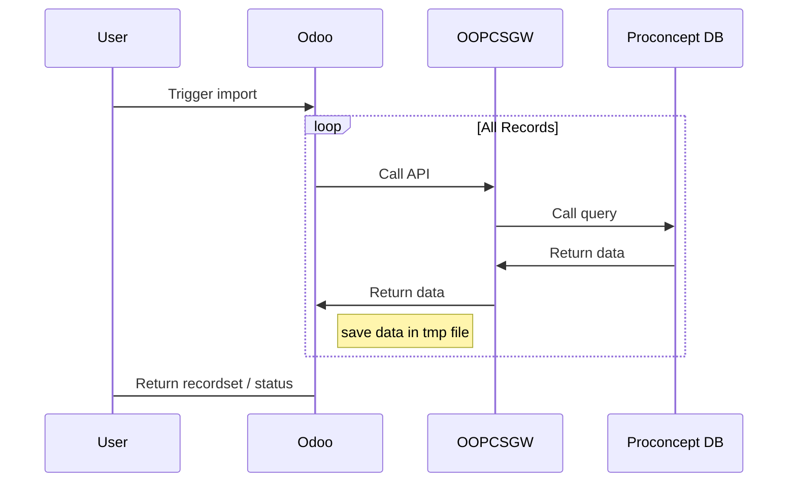
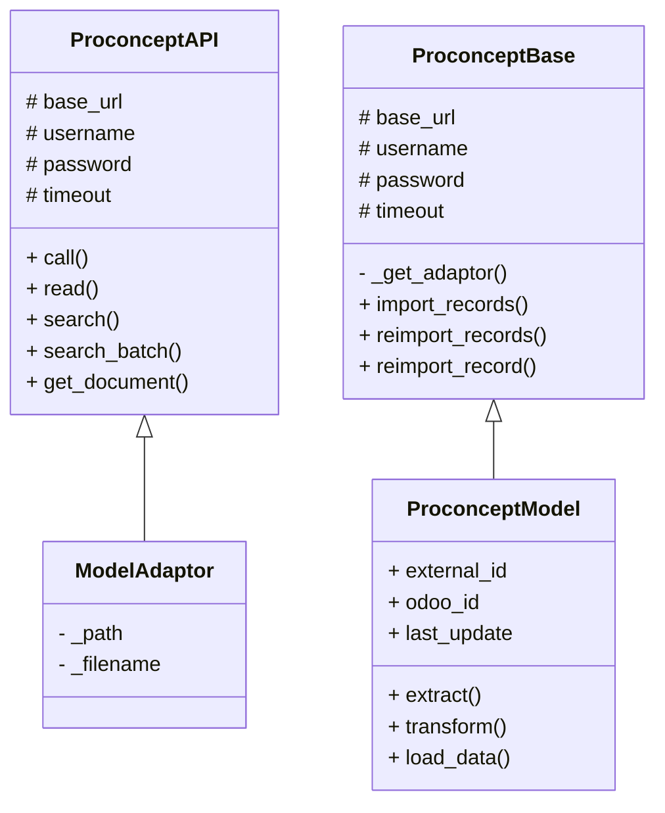
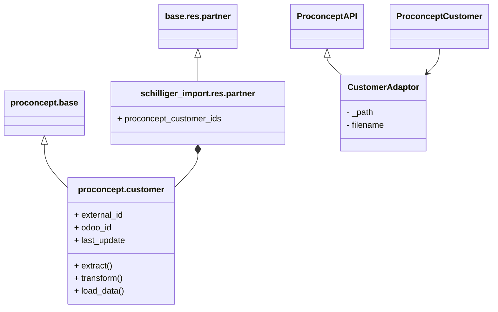

+++
title = 'Odoo - Schilliger'
date = 2025-02-17T10:13:55+07:00
draft = false
showtoc = false
hideSummary = true
disableShare = false
+++

|   |   |
|---|:---|
|**Role**   | Developer  |
|**Techstack**     | Odoo 17 Enterprise, FastAPI  |
|**Module**   |  Contact, Inventory, Purchasing, Sale |

**Schilliger**, a Swiss family-run garden center business, sought to transition from their legacy ERP system, ProConcept, to Odoo 17 Enterprise. The goal was to implement a tailored Odoo solution to streamline operations while ensuring a smooth migration of data and processes. My role was to develop custom Odoo modules to support their specific business needs and facilitate a seamless transition.

## Challenge
1. Nicelabel Module – Implementing a dynamic label printing solution that integrates with a web-based print server while allowing flexible template customization for various product formats.

2. ProConcept Import – Designing a real-time data import pipeline that ensures a parallel and efficient migration from ProConcept to Odoo, overcoming constraints such as speed, memory efficiency, and compatibility with Odoo's worker-based execution model.

## Contribution
1. Nicelabel Module: Developed a custom module leveraging Odoo’s properties field to enable dynamic label template generation, ensuring compatibility across different product formats.

2. ProConcept Import: Designed and implemented a high-performance, memory-efficient import framework capable of real-time data migration while running entirely within Odoo’s worker processes.

3. Provided technical support to ensure a smooth transition from ProConcept to Odoo, minimizing operational disruptions.

## Results
1. Successfully integrated a real-time label printing system, improving efficiency in product labeling and packaging.
2. Developed a scalable data import framework, allowing 1000 cust / minutes to be imported.
3. Ensured a smooth ERP transition, reducing manual effort and operational risks for Schilliger’s business processes.

## Dev Note

### Proconcept Import

To ensure a smooth transition between **ProConcept** and **Odoo**, the company has chosen a **parallel implementation** strategy, where both systems run simultaneously while gradually shifting feature usage to Odoo.

This approach introduces a challenge: **both systems must be aware of each other's data** to maintain consistency. To address this, we implemented a solution that allows Odoo to communicate with ProConcept efficiently, as illustrated in the sequence diagram below.

User can trigger data import from odoo-side. It can be trigger from scheduled action, server action, or even shell command. To ensure that there won't be any duplicate data, it required for some mapping metadata to exist. This class diagram show system design that we choose to implement.  

### Nicelabel
